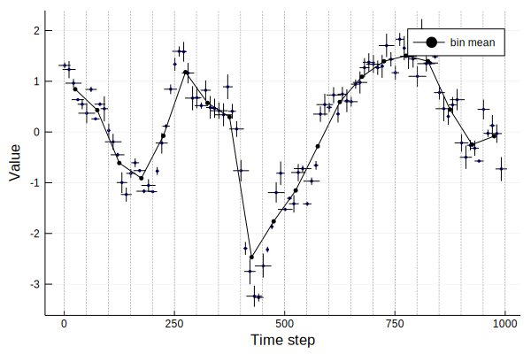

# [Transforming uncertain data to a regular grid](@id transform_data_to_regular_grid)

Time series analysis algorithms often require data that are equally spaced in time. 
Dealing with data that have uncertainties both in values and in time, that becomes tricky.
A solution is to partition the time axis into bins of a certain size, transform 
your data onto those bins, the compute your statistic on the transformed data.

This tutorial shows how uncertain data can be transformed to a regular grid using a 
combination of resampling and binning.

## Some example data

We'll look at the first and second variables of an autoregressive system with 
unidirectional coupling. We'll use 100 points where each time point is spaced 
10 time unit apart. In addition we'll make the positions of the time indices, as 
well as the actual values of the time series, uncertain.

To do this, we'll use the `example_uncertain_indexvalue_datasets` function that ships with 
`UncertainData.jl`. It takes as input a `DiscreteDynamicalSystem` instance,
the number of desired points, and which variables of the system to use for the 
time series. Time series will be generated from a unidirectionally 
coupled AR1 system from the [CausalityTools](https://github.com/kahaaga/CausalityTools.jl) 
package. To simulate real-world data, some noise is added to the values and 
indices.

```julia
using UncertainData, CausalityTools, Plots

system = CausalityTools.ar1_unidir(c_xy = 0.5)
vars = (1, 2)
npts, tstep = 100, 10

d_xind, d_yind = Uniform(2.5, 15.5), Uniform(2.5, 15.5)
d_xval, d_yval = Uniform(0.01, 0.2), Uniform(0.01, 0.2)

X, Y = example_uncertain_indexvalue_datasets(system,
    npts, vars, tstep = tstep,
    d_xind = d_xind, d_yind = d_yind,
    d_xval = d_xval, d_yval = d_yval);
```

Let's plot the data.

```julia 
qs = [0.05, 0.95] # use the same quantile ranges for both indices and values
plot(X, qs, qs, ms = 2, c = :black, marker = stroke(0.01, :black), 
    xlabel = "Time step", ylabel = "Value")
```


Our data have uncertain time indices, so they are not on a regularly spaced grid.
Let's say we want a grid where the left bin edges range from `0` to `1000` in 
steps of `50`. Superimposed on our data, that grid looks as follows.

```julia
resampling = BinnedResampling(0:50:1000, 1000)

qs = [0.05, 0.95] # plotting quantile ranges
plot(X, qs, qs, ms = 2, c = :black, marker = stroke(0.01, :black), 
    xlabel = "Time step", ylabel = "Value")
vline!(0:50:1000 |> collect, label = "", c = :grey, lw = 0.5, ls = :dash)
```


## `BinnedMeanResampling`

Assume that the uncertainties in the time values are independent. Bin averages 
can then be obtained by resampling every uncertain value in the dataset 
many times, keeping track of which draws falls in which time bins, then taking
the average of the draws in each of the bins. We'll resample each point 
`10000` times. In total, the bin means are then computed based on 
`100*10000` draws of the values in the dataset (we constructed the dataset 
so that it has 100 points).

```julia
resampling = BinnedMeanResampling(0:50:1000, 10000)
X_binned_means = resample(X, resampling); # returns a vector of bin means

p = plot(xlabel = "Time step", ylabel = "Value")
plot!(X, c = :blue, ms = 2, marker = stroke(0.01, :black), [0.1, 0.9], [0.1, 0.9])
plot!(inds, X_binned_means, ms = 2, marker = stroke(1.0), lw = 1, c = :black, label = "bin mean")
vline!(resampling.left_bin_edges, label = "", c = :grey, lw = 0.5, ls = :dash)
```



OK, that looks like a reasonable estimate to the mean at this coarser resolution. 
But what if we need more information about each bin than just the mean? The solution 
is to explicitly keep track of the draws in each bin, then representing those draws 
as a distribution.

## `BinnedResampling`

Assume again that the uncertainties in the time values are independent. However,
instead of using bin averages, we're interested in keeping track of the uncertainties
in each bin. Again, resample the values in the dataset many times, but this time, 
instead of directly computing the bin means, we keep track of all draws falling 
in a particular bin. Uncertainties in a bin is then estimated by a kernel density 
estimate over the draws falling in that bin.

Again, we'll sample each point in the dataset `10000` times, yielding a total 
of `100*10000` draws from which the kernel-density-estimated distributions are 
estimated. Some bins may have more draws than others.

```julia
resampling = BinnedResampling(0:50:1000, 1000)
X_binned = resample(X, resampling)
```

`X_binned` is still a `UncertainIndexValueDataset`, but the indices have been reduced 
to `CertainScalar` instances placed at the bin midpoints. The values, however, are kept 
as uncertain values.

Plotting the result:

```julia

# Plot the 90 percentile ranges for both the original distributions/populations and 
# the binned distributions/populations
qs = [0.05, 0.95]
ql = quantile.(X_binned.values, 0.05, 10000)
qh = quantile.(X_binned.values, 0.95, 10000)

plot(xlabel = "Time step", ylabel = "Value")

# Original dataset, bin edges and resampled dataset
plot!(X, c = :blue, ms = 2, marker = stroke(0.01, :black), qs, qs)

vline!(resampling.left_bin_edges, label = "", c = :grey, lw = 0.5, ls = :dash)
plot!(X_binned, c = :red, ms = 4, marker = stroke(0.01, :red), qs, qs, alpha = 0.5)

# Get the bin edges and the quantiles as a band
g = resampling.left_bin_edges
inds = g[1:end-1] .+ step(g)/2
plot!(inds, qh, label = "", c = :red, α = 0.5, ls = :dash)
plot!(inds, ql, label = "", c = :red, α = 0.5, ls = :dash)
```


This binned `UncertainIndexValueDataset` can now be resampled by calling 
`resample(X_binned)`, which will every time yield independent realisations 
that are on the same time grid.

```julia
p = plot(xlabel = "Time step", ylabel = "Value")

for i = 1:10
    timeinds, vals = resample(X_binned)
    plot!(timeinds, vals, 
        c = :black, lw = 0.5, ms = 1, 
        marker = stroke(0.4, :black), label = "")
end

vline!(resampling.left_bin_edges, label = "", c = :grey, lw = 0.5, ls = :dash)
p
```


