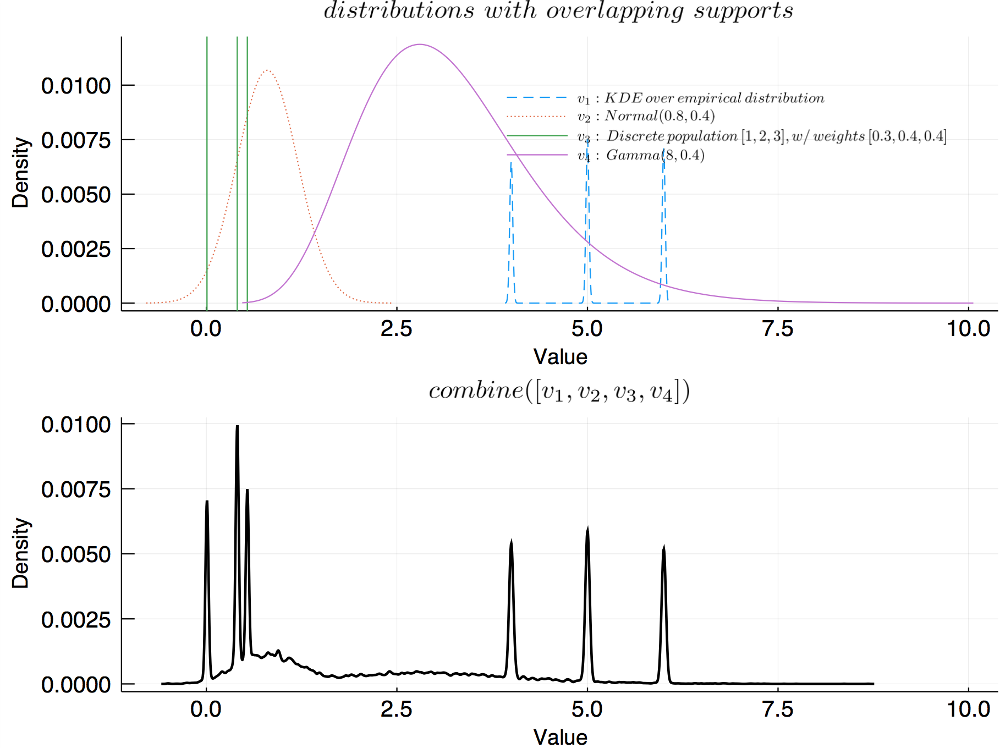
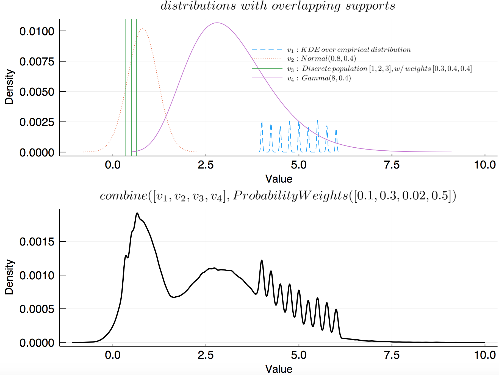
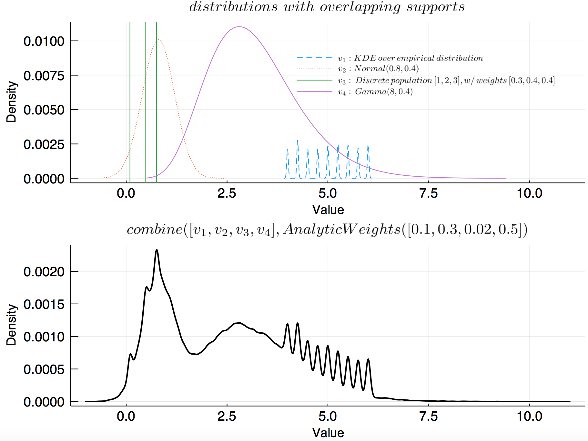
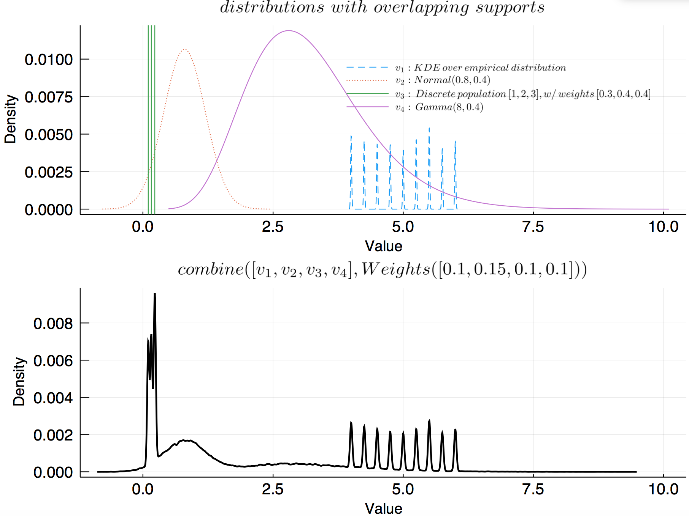

# Combining and merging

Because all uncertainties are handled using a resampling approach, it is trivial to 
[`combine`](@ref) or merge uncertain values of different types into a single uncertain value.

Depending on your data, you may want to choose of one the following ways of 
representing multiple uncertain values as one:

- [Combining](@ref uncertainvalue_combine). An ensemble of uncertain 
    values is represented as a weighted population. This approach is nice if you want 
    to impose expert-opinion on the relative sampling probabilities of uncertain 
    values in the ensemble, but still sample from the entire supports of each of the
    furnishing values. This introduces no additional approximations besides what 
    is already present at the moment you define your uncertain values.
- [Merging](@ref uncertainvalue_merge). Multiple uncertain values are merged using 
    a kernel density estimate to the overall distribution. This approach introduces 
    approximations *beyond* what is present in the uncertain values when you define them.

## [Combining: the population approach](@id uncertainvalue_combine)

**Combining** uncertain values is done by representing them as a weighted population
of uncertain values, which is illustrated in the following example:

```julia
# Assume we have done some analysis and have three points whose uncertainties 
# significantly overlap.
v1 = UncertainValue(Normal(0.13, 0.52))
v2 = UncertainValue(Normal(0.27, 0.42))
v3 = UncertainValue(Normal(0.21, 0.61))

# Give each value equal sampling probabilities and represent as a population
pop = UncertainValue([v1, v2, v3], [1, 1, 1])

# Let the values v1, v2 and v3 be sampled with probability ratios 1-2-3
pop = UncertainValue([v1, v2, v3], [1, 2, 3])
```


This is not restricted to normal distributions! We can combine any type of 
value in our population, even populations!

```julia
# Consider a population of normal distributions, and a gamma distribution
v1 = UncertainValue(Normal(0.265, 0.52))
v2 = UncertainValue(Normal(0.311, 0.15))
v3 = UncertainValue([v1, v2], [2, 1])
v4 = UncertainValue(Gamma(0.5, -1))
pts = [v1, v4]
wts = [2, 1]

# New population is a nested population with unequal weights
pop = UncertainValue(pts, wts)

d1 = density(resample(pop, 20000), label = "population")

d2 = plot()
density!(d2, resample(pop[1], 20000), label = "v1")
density!(d2, resample(pop[2], 20000), label = "v2")

plot(d1, d2, layout = (2, 1), xlabel = "Value", ylabel = "Density", link = :x, xlims = (-2.5, 2.5))
```


This makes it possible treat an ensemble of uncertain values as a single uncertain value.

With equal weights, combining uncertain values introduces no bias beyond what is present in the data, 
because resampling is done from the full supports of each of the furnishing values. 
Additional information on relative sampling probabilities, however, be it informed by
expert opinion or quantative estimates, is easily incorporated by adjusting 
the sampling weights.

## [Merging: KDE approach](@id uncertainvalue_merge)

**Merging** multiple uncertain values could be done by fitting a model distribution to 
the values. Using any specific theoretical distribution as a model for the combined 
uncertainty, however, is in general not possible, because the values may have 
different types of uncertainties.

Thus, in this package, kernel kernel density estimation is used to merge multiple uncertain values. 
This has the advantage that you only have to deal with a single estimate to the combined 
distribution, but introduces bias because the distribution is *estimated* and the 
shape of the distribution depends on the parameters of the KDE procedure.

### Without weights

When no weights are provided, the combined value is computed 
by resampling each of the `N` uncertain values `n/N` times,
then combining using kernel density estimation. 

```@docs
combine(uvals::Vector{AbstractUncertainValue}; n = 1000*length(uvals), 
        bw::Union{Nothing, Real} = nothing)
```

Weights dictating the relative contribution of each 
uncertain value into the combined value can also be provided. `combine` works 
with `ProbabilityWeights`, `AnalyticWeights`, 
`FrequencyWeights` and the generic `Weights`. 

Below shows an example of combining 

```julia
v1 = UncertainValue(rand(1000))
v2 = UncertainValue(Normal, 0.8, 0.4)
v3 = UncertainValue([rand() for i = 1:3], [0.3, 0.3, 0.4])
v4 = UncertainValue(Normal, 3.7, 0.8)
uvals = [v1, v2, v3, v4]

p = plot(title = L"distributions \,\, with \,\, overlapping \,\, supports")
plot!(v1, label = L"v_1", ls = :dash)
plot!(v2, label = L"v_2", ls = :dot)
vline!(v3.values, label = L"v_3") # plot each possible state as vline
plot!(v4, label = L"v_4")

pcombined = plot(combine(uvals), title = L"merge(v_1, v_2, v_3, v_4)", lc = :black, lw = 2)

plot(p, pcombined, layout = (2, 1), link = :x, ylabel = "Density")
```



### With weights

`Weights`, `ProbabilityWeights` and  `AnalyticWeights` are functionally the same. Either 
may be used depending on whether the weights are assigned subjectively or quantitatively. 
With `FrequencyWeights`, it is possible to control the exact number of draws from each 
uncertain value that goes into the draw pool before performing KDE.

#### `ProbabilityWeights`

```@docs
combine(uvals::Vector{AbstractUncertainValue}, weights::ProbabilityWeights)
```

For example:

```julia 
v1 = UncertainValue(UnivariateKDE, rand(4:0.25:6, 1000), bandwidth = 0.02)
v2 = UncertainValue(Normal, 0.8, 0.4)
v3 = UncertainValue([rand() for i = 1:3], [0.3, 0.3, 0.4])
v4 = UncertainValue(Gamma, 8, 0.4)
uvals = [v1, v2, v3, v4];

p = plot(title = L"distributions \,\, with \,\, overlapping \,\, supports")
plot!(v1, label = L"v_1: KDE \, over \, empirical \, distribution", ls = :dash)
plot!(v2, label = L"v_2: Normal(0.8, 0.4)", ls = :dot)
# plot each possible state as vline
vline!(v3.values, 
    label = L"v_3: \, Discrete \, population\, [1,2,3], w/ \, weights \, [0.3, 0.4, 0.4]") 
plot!(v4, label = L"v_4: \, Gamma(8, 0.4)")

pcombined = plot(
    combine(uvals, ProbabilityWeights([0.1, 0.3, 0.02, 0.5]), n = 100000, bw = 0.05), 
    title = L"combine([v_1, v_2, v_3, v_4], ProbabilityWeights([0.1, 0.3, 0.02, 0.5])", 
    lc = :black, lw = 2)

plot(p, pcombined, layout = (2, 1), size = (800, 600), 
    link = :x, 
    ylabel = "Density",
    tickfont = font(12),
    legendfont = font(8), fg_legend = :transparent, bg_legend = :transparent)
```



#### `AnalyticWeights`

```@docs
combine(uvals::Vector{AbstractUncertainValue}, weights::AnalyticWeights)
```

For example:

```julia
v1 = UncertainValue(UnivariateKDE, rand(4:0.25:6, 1000), bandwidth = 0.02)
v2 = UncertainValue(Normal, 0.8, 0.4)
v3 = UncertainValue([rand() for i = 1:3], [0.3, 0.3, 0.4])
v4 = UncertainValue(Gamma, 8, 0.4)
uvals = [v1, v2, v3, v4];

p = plot(title = L"distributions \,\, with \,\, overlapping \,\, supports")
plot!(v1, label = L"v_1: KDE \, over \, empirical \, distribution", ls = :dash)
plot!(v2, label = L"v_2: Normal(0.8, 0.4)", ls = :dot)
vline!(v3.values, label = L"v_3: \, Discrete \, population\, [1,2,3], w/ \, weights \, [0.3, 0.4, 0.4]") # plot each possible state as vline
plot!(v4, label = L"v_4: \, Gamma(8, 0.4)")

pcombined = plot(combine(uvals, AnalyticWeights([0.1, 0.3, 0.02, 0.5]), n = 100000, bw = 0.05), 
    title = L"combine([v_1, v_2, v_3, v_4], AnalyticWeights([0.1, 0.3, 0.02, 0.5])", lc = :black, lw = 2)

plot(p, pcombined, layout = (2, 1), size = (800, 600), 
    link = :x, 
    ylabel = "Density",
    tickfont = font(12),
    legendfont = font(8), fg_legend = :transparent, bg_legend = :transparent)
```



### Generic `Weights`

```@docs
combine(uvals::Vector{AbstractUncertainValue}, weights::Weights; 
    n = 1000*length(uvals))
```

For example:

```julia
v1 = UncertainValue(UnivariateKDE, rand(4:0.25:6, 1000), bandwidth = 0.01)
v2 = UncertainValue(Normal, 0.8, 0.4)
v3 = UncertainValue([rand() for i = 1:3], [0.3, 0.3, 0.4])
v4 = UncertainValue(Gamma, 8, 0.4)
uvals = [v1, v2, v3, v4];

p = plot(title = L"distributions \,\, with \,\, overlapping \,\, supports")
plot!(v1, label = L"v_1: KDE \, over \, empirical \, distribution", ls = :dash)
plot!(v2, label = L"v_2: Normal(0.8, 0.4)", ls = :dot)
# plot each possible state as vline
vline!(v3.values, 
    label = L"v_3: \, Discrete \, population\, [1,2,3], w/ \, weights \, [0.3, 0.4, 0.4]") 
plot!(v4, label = L"v_4: \, Gamma(8, 0.4)")

pcombined = plot(combine(uvals, Weights([0.1, 0.15, 0.1, 0.1]), n = 100000, bw = 0.02), 
    title = L"combine([v_1, v_2, v_3, v_4],  Weights([0.1, 0.15, 0.1, 0.1]))", 
    lc = :black, lw = 2)

plot(p, pcombined, layout = (2, 1), size = (800, 600), 
    link = :x, 
    ylabel = "Density",
    tickfont = font(12),
    legendfont = font(8), fg_legend = :transparent, bg_legend = :transparent)
```



### `FrequencyWeights`

Using `FrequencyWeights`, one may specify the number of times each of the uncertain values 
should be sampled to form the pooled resampled draws on which the final kernel density 
estimate is performed.

```@docs
combine(uvals::Vector{AbstractUncertainValue}, weights::FrequencyWeights)
```

For example:

```julia
v1 = UncertainValue(UnivariateKDE, rand(4:0.25:6, 1000), bandwidth = 0.01)
v2 = UncertainValue(Normal, 0.8, 0.4)
v3 = UncertainValue([rand() for i = 1:3], [0.3, 0.3, 0.4])
v4 = UncertainValue(Gamma, 8, 0.4)
uvals = [v1, v2, v3, v4];

p = plot(title = L"distributions \,\, with \,\, overlapping \,\, supports")
plot!(v1, label = L"v_1: KDE \, over \, empirical \, distribution", ls = :dash)
plot!(v2, label = L"v_2: Normal(0.8, 0.4)", ls = :dot)
# plot each possible state as vline
vline!(v3.values, 
    label = L"v_3: \, Discrete \, population\, [1,2,3], w/ \, weights \, [0.3, 0.4, 0.4]") 
plot!(v4, label = L"v_4: \, Gamma(8, 0.4)")

pcombined = plot(combine(uvals, FrequencyWeights([10000, 20000, 3000, 5000]), bw = 0.05), 
    title = L"combine([v_1, v_2, v_3, v_4], FrequencyWeights([10000, 20000, 3000, 5000])", 
    lc = :black, lw = 2)

plot(p, pcombined, layout = (2, 1), size = (800, 600), 
    link = :x, 
    ylabel = "Density",
    tickfont = font(12),
    legendfont = font(8), fg_legend = :transparent, bg_legend = :transparent)
```


