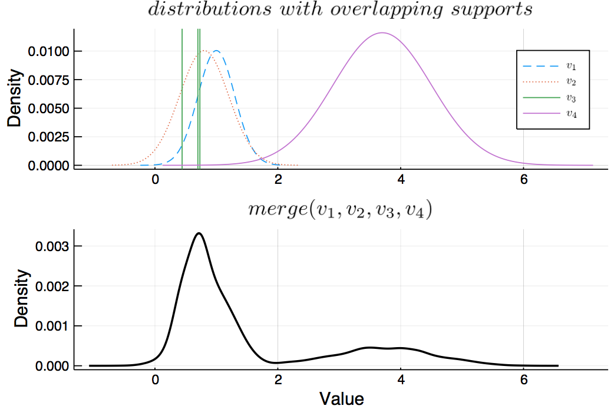

# Merging different uncertain values

Different uncertain values are seamlessly merged together into one by first resampling each uncertain value, the pooling together all the draws and 
performing kernel density estimation on the draws. 

## Documentation

```@docs 
merge
```

## Example 

```julia
v1 = UncertainValue(Normal, 1, 0.3)
v2 = UncertainValue(Normal, 0.8, 0.4)
v3 = UncertainValue([rand() for i = 1:3], [0.3, 0.3, 0.4])
v4 = UncertainValue(Normal, 3.7, 0.8)
uvals = [v1, v2, v3, v4]

p = plot(title = L"distributions \,\, with \,\, overlapping \,\, supports")
plot!(v1, label = L"v_1", ls = :dash)
plot!(v2, label = L"v_2", ls = :dot)
vline!(v3.values, label = L"v_3") # plot each possible state as vline
plot!(v4, label = L"v_4")

pmerge = plot(merge(uvals), 
    title = L"merge(v_1, v_2, v_3, v_4)", 
    lc = :black, lw = 2)

plot(p, pmerge, layout = (2, 1), link = :x, ylabel = "Density")
```


