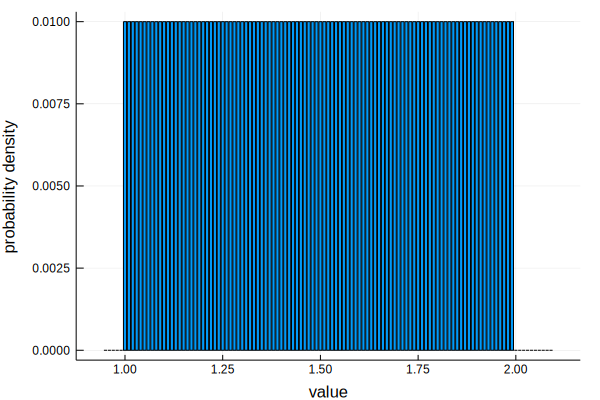
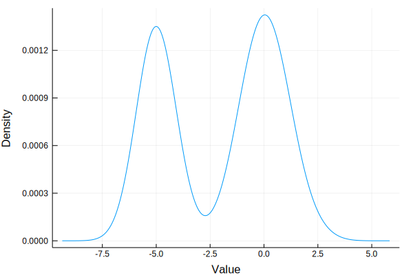

# Uncertain values

## `UncertainValue` constructors

The following convenience constructors are used to defined uncertain values.

```@docs
UncertainValue
```

## Uncertain data types

### [Theoretical distributions](@id uncertain_value_theoretical_distribution)

It is common in the scientific literature to encounter uncertain data values
which are reported as following a specific distribution. For example, an author
report the mean and standard deviation of a value stated to follow a
normal distribution. `UncertainData.jl` makes it easy to represent such values!

```@docs
UncertainScalarBetaDistributed
UncertainScalarBetaBinomialDistributed
UncertainScalarBetaPrimeDistributed
UncertainScalarBinomialDistributed
UncertainScalarFrechetDistributed
UncertainScalarGammaDistributed
UncertainScalarNormallyDistributed
UncertainScalarUniformlyDistributed
```

### [Fitted theoretical distributions](@id uncertain_value_fitted_theoretical_distribution)

For data values with histograms close to some known distribution, the user
may choose to represent the data by fitting a theoretical distribution to the
values. This will only work well if the histogram closely resembles a
theoretical distribution.

```@docs
UncertainScalarTheoreticalFit
```

### [Kernel density estimates (KDE)](@id uncertain_value_kde)

When your data have an empirical distribution that doesn't follow any obvious
theoretical distribution, the data may be represented by a kernel density
estimate to the underlying distribution.

```@docs
UncertainScalarKDE
```

#### Extended example

Let's create a bimodal distribution, then sample 10000 values from it.

```@example kde1
using UncertainData, Distributions, Plots, StatsPlots
# Draw 1000 points from a three-component mixture model to create a multimodal distribution.
n1 = Normal(-3.0, 1.2)
n2 = Normal(8.0, 1.2)
n3 = Normal(0.0, 2.5)
M = MixtureModel([n1, n2, n3])
s = rand(M, 1000);
histogram(s, nbins = 80)
ylabel!("Frequency"); xlabel!("Value")
savefig("figs/bimodal_empirical.svg") #hide
```


It is not obvious which distribution to fit to such data.
A kernel density estimate, however, will always be a decent representation
of the data, because it doesn't follow a specific distribution and adapts to
the data values.

To create a kernel density estimate, simply call the
`UncertainValue` constructor with a vector containing the sample. This will trigger
kernel density estimation.

```@example kde1
x = UncertainValue(s)
```

The plot below compares the empirical histogram (here represented as a density
plot) with our kernel density estimate.

```@example kde1
x = UncertainValue(s)
density(s, label = "10000 mixture model (M) samples")
density!(rand(x, 50000),
    label = "50000 samples from KDE estimate to M")
xlabel!("data value")
ylabel!("probability density")
savefig("figs/KDEUncertainValue.svg") #hide
```


### [Populations](@id uncertain_value_population)

The `UncertainScalarPopulation` type allows representation of an uncertain scalar 
represented by a population of values who will be sampled according to a set of 
explicitly provided probabilities. See [examples](@ref uncertainvalue_combine).

```@docs
UncertainScalarPopulation
```

### Certain values

The `CertainScalar` allows representation of values with no uncertainty. It behaves 
just as a scalar, but can be mixed with uncertain values when performing 
[mathematical operations](../mathematics/elementary_operations.md) and 
[resampling](../resampling/resampling_overview.md). 

```@docs
CertainScalar
```

### Compatibility with Measurements.jl

`Measurement` instances from the Measurements.jl package[^1] are in UncertainData.jl represented as normal distributions. If exact error propagation is a requirement and your data is exclusively normally distributed, use Measurements.jl. If your data is not necessarily 
normally distributed and contain errors of different types, and 
a resampling approach to error propagation is desired, use UncertainData.jl. 

See the [`UncertainValue`](@ref) constructor for instructions on how to 
convert `Measurement`s to uncertain values compatible with this package.

[^1]:
    M. Giordano, 2016, "Uncertainty propagation with functionally correlated quantities", arXiv:1610.08716 (Bibcode: 2016arXiv161008716G).


## Examples

First, load the necessary packages:

```julia
using UncertainData, Distributions, KernelDensity, Plots
```

### Theoretical distributions

#### A uniformly distributed uncertain value

Consider the following contrived example. We've measure a data value with a poor instrument 
that tells us that the value lies between `-2` and `3`. However, we but that we know nothing 
more about how the value is distributed on that interval. Then it may be reasonable to 
represent that value as a uniform distribution on `[-2, 3]`.

To construct an uncertain value following a uniform distribution, we use the constructor 
for theoretical distributions with known parameters 
(`UncertainValue(distribution, params...)`). 

The uniform distribution is defined by its lower and upper bounds, so we'll provide 
these bounds as the parameters.

```julia
u = UncertainValue(Uniform, 1, 2)

# Plot the estimated density
bar(u, label = "", xlabel = "value", ylabel = "probability density")
```



#### A normally distributed uncertain value

A situation commonly encountered is to want to use someone else's data from a publication. 
Usually, these values are reported as the mean or median, with some associated uncertainty. 
Say we want to use an uncertain value which is normally distributed with mean `2.1` and 
standard deviation `0.3`.

Normal distributions also have two parameters, so we'll use the two-parameter constructor 
as we did above. 

```julia
u = UncertainValue(Normal, 2.1, 0.3)

# Plot the estimated density
bar(u, label = "", xlabel = "value", ylabel = "probability density")
```


### Kernel density estimated distributions

One may also be given a a distribution of numbers that's not quite normally distributed. 
How to represent this uncertainty? Easy: we use a kernel density estimate to the distribution.

Let's define a complicated distribution which is a mixture of two different normal 
distributions, then draw a sample of numbers from it.

```julia
M = MixtureModel([Normal(-5, 0.5), Normal(0.2)])
some_sample = rand(M, 250)
```

Now, pretend that `some_sample` is a list of measurements we got from somewhere. 
KDE estimates to the distribution can be defined implicitly or explicitly as follows:

```julia 
# If the only argument to `UncertainValue()` is a vector of number, KDE will be triggered.
u = UncertainValue(rand(M, 250)) 

# You may also tell the constructor explicitly that you want KDE. 
u = UncertainValue(UnivariateKDE, rand(M, 250))
```

Now, let's plot the resulting distribution. _Note: this is not the original mixture of 
Gaussians we started out with, it's the kernel density estimate to that mixture!_

```julia 
# Plot the estimated distribution.
plot(u, xlabel = "Value", ylabel = "Probability density")
```



### Theoretical distributions fitted to empirical data

One may also be given a dataset whose histogram looks a lot like a theoretical
distribution. We may then select a theoretical distribution and fit its
parameters to the empirical data.

Say our data was a sample that looks like it obeys Gamma distribution.

```julia
# Draw a 2000-point sample from a Gamma distribution with parameters α = 1.7 and θ = 5.5
some_sample = rand(Gamma(1.7, 5.5), 2000)
```

To perform a parameter estimation, simply provide the distribution as the first 
argument and the sample as the second argument to the `UncertainValue` constructor.

```julia
# Take a sample from a Gamma distribution with parameters α = 1.7 and θ = 5.5 and 
# create a histogram of the sample.
some_sample = rand(Gamma(1.7, 5.5), 2000)

p1 = histogram(some_sample, normalize = true,
    fc = :black, lc = :black,
    label = "", xlabel = "value", ylabel = "density")

# For the uncertain value representation, fit a gamma distribution to the sample. 
# Then, compare the histogram obtained from the original distribution to that obtained 
# when resampling the fitted distribution
uv = UncertainValue(Gamma, some_sample)

# Resample the fitted theoretical distribution
p2 = histogram(resample(uv, 10000), normalize = true,
    fc = :blue, lc = :blue,
    label = "", xlabel = "value", ylabel = "density")

plot(p1, p2, layout = (2, 1), link = :x)
```

As expected, the histograms closely match (but are not exact because we estimated
the distribution using a limited sample).


### Populations

See [examples for combining multiple values](@ref uncertainvalue_combine).

## Combining/merging

Because all uncertainties are handled using a resampling approach, it is trivial to 
[`combine`](@ref) or merge uncertain values of different types into a single uncertain value.

Depending on your data, you may want to choose of one the following ways of 
representing multiple uncertain values as one.

### [Exact approach: populations](@id uncertainvalue_combine)

Combining uncertain values is done by representing them as a weighted population
of uncertain values. This approach exactly preserves the uncertainties of 
the multiple uncertain values during resampling. Adding weights makes it possible to
impose expert-opinion on the relative sampling probabilities of uncertain 
values but still sample from the entire supports of the furnishing distributions.

With equal weights, combining uncertain values introduces no bias beyond what is present in the data, 
because resampling is done from the full supports of each of the furnishing values. 
Additional information on relative sampling probabilities, however, be it informed by
expert opinion or quantative estimates, is easily incorporated by adjusting 
the sampling weights.

```@example
using UncertainData, Plots, StatsPlots

# Assume we have done some analysis and have three points whose uncertainties 
# significantly overlap. We want to combine these into one uncertain value.
v1 = UncertainValue(Normal(-0.1, 0.52))
v2 = UncertainValue(Normal(0.27, 0.42))
v3 = UncertainValue(Normal(0.5, 0.61))

# Let the values v1, v2 and v3 be sampled with equal importance
pop = UncertainValue([v1, v2, v3], [1, 1, 1])

# Let the values v1, v2 and v3 be sampled with relative importance 1-2-3
pop = UncertainValue([v1, v2, v3], [1, 2, 3])

d1 = plot()
density!(d1, resample(pop, 20000), label = "Overall population")
d2 = plot()
density!(d2, resample(v1, 20000), label = "v1")
density!(d2, resample(v2, 20000), label = "v2")
density!(d2, resample(v3, 20000), label = "v3")
plot(d1, d2, layout = (2, 1), xlabel = "Value", ylabel = "Density", 
    link = :x, xlims = (-2.5, 2.5), 
    legend = :topleft, fg_legend = :transparent, bg_legend = :transparent)
savefig("figs/population_ex1.png") #hide
```


This is not restricted to normal distributions! We can combine any type of 
value in our population, even populations!

```@example
using UncertainData, Plots, StatsPlots
v1 = UncertainValue(Normal, 0.265, 0.52)
v2 = UncertainValue(Normal, 0.311, 0.15)
v3 = UncertainValue(Beta, 0.7, 0.8)
v4 = UncertainValue(Gamma, 0.5, 1.0)

# Define two sub-populations. Members of each sub-population are sampled 
# with equal importance.
p1, p2 = UncertainValue([v1, v4], [1, 1]), UncertainValue([v2, v3], [1, 1])

# In the overall population, sub-populations are sampled with relative importance 2 to 1.
pop = UncertainValue([p1, p2], [2, 1])

d1 = plot()
density!(d1, resample(pop, 20000), label = "Overall population")
d2 = plot()
density!(d2, resample(pop[1], 20000), label = "Subpopulation p1 (v1 and v4)")
density!(d2, resample(pop[2], 20000), label = "Subpopulation p2 (v2 and v3)")

d3 = plot()
density!(d3, resample(v1, 20000), label = "v1")
density!(d3, resample(v2, 20000), label = "v2")
density!(d3, resample(v3, 20000), label = "v3")
density!(d3, resample(v4, 20000), label = "v4")

plot(d1, d2, d3, layout = (3, 1), xlabel = "Value", ylabel = "Density", 
    link = :x, xlims = (-2.5, 2.5), 
    legend = :topleft, fg_legend = :transparent, bg_legend = :transparent)
savefig("figs/population_ex2.png") #hide
```


### [Approximate approach: KDE](@id uncertainvalue_merge)

Merging multiple uncertain values could be done by fitting a model distribution to 
the values. Using any specific theoretical distribution as a model for the combined 
uncertainty, however, is in general not possible, because the values may have 
different types of uncertainties.

The `combine` function instead uses kernel density estimation is used to merge 
multiple uncertain values. This has the advantage that you only 
have to deal with a single estimate to the combined distribution, but 
introduces bias because the distribution is *estimated*. Additionally, the
shape of the distribution depends on the parameters of the KDE procedure.

```@docs
combine(uvals::Vector{AbstractUncertainValue})
```

#### Example

```@example
using UncertainData, Plots, StatsPlots
v1 = UncertainValue(UnivariateKDE, rand(4:0.25:6, 1000), bandwidth = 0.02)
v2 = UncertainValue(Normal, 0.8, 0.4)
v3 = UncertainValue([rand() for i = 1:3], [0.3, 0.3, 0.4])
v4 = UncertainValue(Gamma, 8, 0.4)
uvals = [v1, v2, v3, v4];

p = plot()
plot!(v1, label = "v1", ls = :dashdot)
plot!(v2, label = "v2", ls = :dot)
vline!(v3, label = "v3", ls = :dash) # plot each possible state as vline
plot!(v4, label = "v4")

pcombined = plot(lc = :black, 
    combine(uvals, n = 100000), 
    title = "combine([v1, v2, v3, v4])")
pcombined_pw = plot(lc = :black, 
    combine(uvals, ProbabilityWeights([0.1, 0.3, 0.02, 0.5]), n = 100000, bw = 0.05), 
    title = "combine([v1, v2, v3, v4], ProbabilityWeights([0.1, 0.3, 0.02, 0.5])")
pcombined_fw = plot(lc = :black, 
    combine(uvals, FrequencyWeights([10000, 20000, 3000, 5000]), bw = 0.05), 
    title = "combine([v1, v2, v3, v4], FrequencyWeights([10000, 20000, 3000, 5000])")

plot(p, pcombined, pcombined_pw, pcombined_fw, 
    layout = (4, 1), link = :x, ylabel = "Density", lw = 1,
        titlefont = font(8), guidefont = font(9), size = (700, 600))
savefig("figs/combine_ex.png") #hide
```


## Mathematical operations

# Elementary mathematical operations

Elementary mathematical operations (`+`, `-`, `*`, and `/`) between arbitrary 
uncertain values of different types and scalars are supported. 

## Syntax

Resampling is used to perform the mathematical operations. All mathematical 
operations return a vector containing the results of repeated element-wise operations 
(where each element is a resampled draw from the furnishing distribution(s) of the 
uncertain value(s)).

The default number of realizations is set to `10000`. This allows calling `uval1 + uval2` 
for two uncertain values `uval1` and `uval2`. If you need to tune the number of resample 
draws to `n`, use the `+(uval1, uval2, n)` syntax. 

## Future improvements

In the future, elementary operations might be improved for certain combinations of uncertain 
values where exact expressions for error propagation are now, for example using the 
machinery in `Measurements.jl` for normally distributed values.

## Supported operations

Performing elementary operations with `CertainScalar`s behaves as for scalars.

## Addition

```@docs
Base.:+(a::AbstractUncertainValue, b::AbstractUncertainValue)
Base.:-(a::AbstractUncertainValue, b::AbstractUncertainValue)
Base.:*(a::AbstractUncertainValue, b::AbstractUncertainValue)
Base.:/(a::AbstractUncertainValue, b::AbstractUncertainValue)
```

