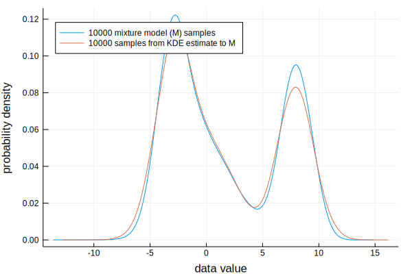

# Overview

The following constructors are available for defining uncertain values:

1. `UncertainValue(empiricaldata::Vector)`. Return an uncertain value represented by a kernel density estimate to the empirical distribution.

# Uncertain value from KDE estimate

!!! note "KDE constructor: when the data follows an unknown/empirical distribution"
    Unless you know specifically what distribution your data follows, it is
    recommended to use kernel density estimation to construct the uncertain
    value.

The

```julia
function UncertainValue(kerneldensity::Type{K}, data::Vector{T};
        kernel::Type{D} = Normal,
        npoints::Int = 2048) where {K <: KernelDensity.UnivariateKDE, D <: Distributions.Distribution, T}
end
```

If the only argument to the `UncertainValue` constructor is a vector of values,
the default behaviour is to represent the distribution by a kernel density
estimate (KDE).

Gaussian kernels are used by default.

The `UncertainValue(v::Vector)` constructor, or alternatively
`UncertainValue(UnivariateKDE, v::Vector)`, returns an uncertain value of the  `UncertainScalarKDE` type.

If the only argument to the UncertainValue constructor is an empirical distribution (a vector of values), then kernel density estimation is used to approximate the distribution.


``` julia tab="Implicit KDE constructor"
using Distributions, UncertainData

# Create a normal distribution
d = Normal()

# Draw a 1000-point sample from the distribution.
some_sample = rand(d, 1000)

# Use the implicit KDE constructor to create the uncertain value
uv = UncertainValue(v::Vector)
```

``` julia tab="Explicit KDE constructor"
using Distributions, UncertainData, KernelDensity

# Create a normal distribution
d = Normal()

# Draw a 1000-point sample from the distribution.
some_sample = rand(d, 1000)

# Use the explicit KDE constructor to create the uncertain value.
# This constructor follows the same convention as when fitting distributions
# to empirical data, so this is the recommended way to construct KDE estimates.
uv = UncertainValue(UnivariateKDE, v::Vector)
```

``` julia tab="Selecting a kernel"
using Distributions, UncertainData, KernelDensity

# Create a normal distribution
d = Normal()

# Draw a 1000-point sample from the distribution.
some_sample = rand(d, 1000)

# Use the explicit KDE constructor to create the uncertain value, specifying
# that we want to use normal distributions as the kernel. The kernel can be
# any valid kernel from Distributions.jl, and the default is to use normal
# distributions.
uv = UncertainValue(UnivariateKDE, v::Vector; kernel = Normal)
```

``` julia tab="# points"
using Distributions, UncertainData, KernelDensity

# Create a normal distribution
d = Normal()

# Draw a 1000-point sample from the distribution.
some_sample = rand(d, 1000)

# Use the explicit KDE constructor to create the uncertain value, specifying
# the number of points we want to use for the kernel density estimate. Fast
# Fourier transforms are used behind the scenes, so the number of points
# should be a power of 2 (the default is 2048 points).
uv = UncertainValue(UnivariateKDE, v::Vector; npoints = Normal)
```


## Example: KDE estimate of uncertain value

To visualize this, let's create a bimodal distribution, then sample 10000
values from this distribution.

```julia
using Distributions

n1 = Normal(-3.0, 1.2)
n2 = Normal(8.0, 1.2)
n3 = Normal(0.0, 2.5)

# Use a mixture model to create a bimodal distribution
M = MixtureModel([n1, n2, n3])

# Sample the mixture model.
samples_empirical = rand(M, Int(1e4));
```

To construct an uncertain value from this distribution, we simply call
`UncertainValue(samples_empirical)`. This will create a kernel density estimate
for our sample. We plot the original distribution together with some draws from
our kernel density estimate below.

```julia
using Plots, StatPlots, UncertainData
uv = UncertainValue(samples_empirical)
density(mvals, label = "10000 mixture model (M) samples")
density!(rand(uv, Int(1e4)),
    label = "10000 samples from KDE estimate to M")
xlabel!("data value")
ylabel!("probability density")
```



# Uncertain values from known distributions

!!! note ""
	When the uncertainty in your data is stated to follow some specific
	distribution with known parameters, e.g. a normal distribution with known
	mean and standard deviation, you should use one of the following
	constructors.

The order the parameters are provided to the constructor is the same as for constructing the equivalent distributions in `Distributions.jl`.

- `UncertainValue(d::Type{D}, a<:Number, b<:Number) where {D<:Distributions.Distribution}`. Creates an uncertain value consisting of a two-parameter distribution of type `d` with parameters `a` and `b`. Precisely what  `a` and `b` are depends on which distribution is provided.
- `UncertainValue(d::Type{D}, a<:Number, b<:Number, c<:Number) where {D<:Distributions.Distribution}`. Creates an uncertain value consisting of a three-parameter distribution of type `d` with parameters `a`, `b` and `c`. Precisely what `a`, `b` and `c` are depends on which distribution is provided.


# Uncertain values from fitted distributions

For data values with histograms close to some known distribution, the user
may choose to represent the data by fitting a theoretical distribution to the
values. This will only work well if the histogram closely resembles a
theoretical distribution.

Be sure to actually look at you data before deciding on an appropriate distribution to fit, though! You won't get any error messages if you try to fit a distribution that does not match your data!

## Constructor
To construct uncertain values represented by empirical distributions, use the following constructor.

- `UncertainValue(d::Type{D}, empiricaldata) where {D<:Distributions.Distribution}`. This will fit a distribution of type `d` to the data and keep that as the representation of the empirical distribution. Calls `Distributions.fit` behind the scenes.

## Supported distributions

Supported distributions are `Uniform`, `Normal`, `Gamma`, `Beta`, `BetaPrime`,
`Frechet`, `Binomial`, `BetaBinomial`.

## Examples

The following examples show how to fit a distribution to a sample of numbers.
In all the examples, we're trying to fit the same distribution to our sample
as the distribution from which we draw the sample. Thus, we will get good fits.
In practical applications, the user should only fit a specific distributions
after investigating the histogram of the data.

``` julia tab="Uniform"
using Distributions, UncertainData

# Create a normal distribution
d = Uniform()

# Draw a 1000-point sample from the distribution.
some_sample = rand(d, 1000)

# Define an uncertain value by fitting a uniform distribution to the sample.
uv = UncertainValue(Uniform, some_sample)
```

``` julia tab="Normal"
using Distributions, UncertainData

# Create a normal distribution
d = Normal()

# Draw a 1000-point sample from the distribution.
some_sample = rand(d, 1000)

# Define an uncertain value by fitting a Normal distribution to the sample.
uv = UncertainValue(Normal, some_sample)
```

- `UncertainValue(Uniform, rand(Uniform(-2, 3), 1000))`. Fits a uniform distribution to 1000 values generated uniformly on the interval `[-2, 3]`.
- `UncertainValue(Normal, rand(Normal(), 1000))`. Fits a normal distribution to 1000 values generated from a normal distribution.
- `UncertainValue(Gamma, rand(Gamma(), 1000))`. Fits a gamma distribution to 1000 values generated from a gamma distribution.
- `UncertainValue(Beta, rand(Gamma(), 1000))`. Fits a beta distribution to 1000 values generated from a gamma distribution (obviously not a good idea; visualise your distribution before deciding on which distribution to fit!).
